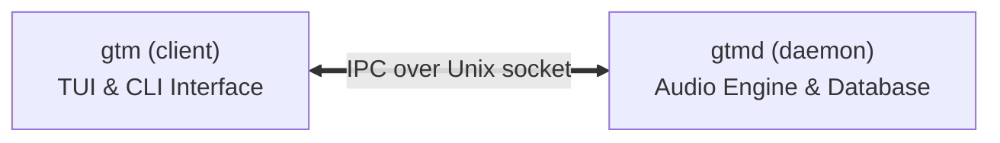

## On this page

- [Overview](#_overview)
- [How it works](#_how-it-works)
- [Features](#_features)

## Overview

**gtm** ("goto music") is a terminal music player with background playback,
YouTube and Spotify integration, and a focus on discoverability.

It is built as a small daemon (`gtmd`) and a thin client (`gtm`). The client
opens a keyboard-driven TUI by default, but every control is also available
from a plain CLI — so the same tool drives interactive use and scripting.

---

## How it works

- The daemon owns audio output, the library database, network providers, and
  the playback state machine.
- The client renders the TUI and sends requests; the daemon streams events back
  in real time.
- Multiple `gtm` processes can attach to the same daemon simultaneously.

---

## Features

- **Background playback** — detach and reattach from anywhere.
- **Library** — scan directories; browse All Tracks, Liked, Albums, Artists,
  Playlists, Spotify, Radio.
- **Playback** — queue management, repeat (Off / One / All), shuffle,
  pitch-preserving speed (0.25×–2.0×), volume, seek.
- **Crossfade** — gapless-ish transitions with a configurable 0–30 s duration.
- **Equalizer** — 15-band ISO 1/3-octave graphic EQ with 16 presets.
- **Visualizer** — five render styles (Braille, Blocks, Mirror, Gradient,
  Spectrum) driven by live FFT.
- **Lyrics** — synced lyrics from LRCLIB, sidecar `.lrc` / `.srt` / `.json`
  files, offline cache, and enhanced LRC word-level timing.
- **Cover art** — fetched automatically via MusicBrainz, Deezer, or Spotify;
  rendered inline in terminals that support the Kitty/iterm2 image protocol.
- **Theming** — 16 built-in themes, user TOML themes, reactive accent colors
  extracted from the current track's artwork, transparent mode.
- **YouTube / Spotify / Subsonic / Podcasts / Radio** — search, stream, and
  manage remote sources.
- **MPRIS** — D-Bus media controls (feature-gated, enabled by default).
