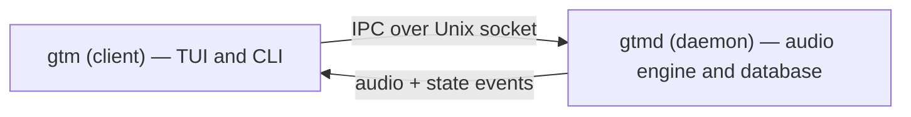

`gtm` is a reimagined audio player for the terminal, inspired by the strengths and limitations of existing implementations and (shamelessly)  borrows a lot of the good parts from them.

Designed from the ground up with integration with other terminal tools (via IPC), `gtm` is actually the client for `gtmd`, the daemon process responsible for playback. As a client, the `gtm` command launches the main TUI (terminal user interface) which is keyboard driven and has floating pickers for most features/actions. 

```mermaid
graph LR
    Client["gtm (client) — TUI and CLI"]
    Daemon["gtmd (daemon) — audio engine and database"]
    Client -->|IPC over Unix socket| Daemon
    Daemon -->|audio + state events| Client
```

The daemon owns audio output, the library database, network providers, and
  the playback state machine. A client just sends requests; the daemon streams events back
  in real time. Multiple `gtm` processes (or any clients) can attach to the same daemon simultaneously.

Using this approach of having the client separate from the daemon (which is like a server) we can have uninterrupted playback that is not attached to our terminal session.

The client is free to attach and detach as the user pleases, allowing the flexibility to control playback without having to leave the terminal. This is a big deal if one wants to avoid too much context switching.

Terminal (power) users have an obsession of integrating their essential tools into their editor (`nvim`, btw), this is made possible by `gtmd` which allows for remote control and has a 'pulse' socket for sending updates to clients using binary encoded frames (decoding handled by MessagePack in nvim). Yes, there's a gtm.nvim and it not only brings image rendering support inside of the editor, it also takes over your theme and makes it reactive too! 

> [!NOTE]
>
> The more the merrier, if you're interested in working on a client for your editor, see this issue on GitHub
>

Good to know, this project is not affiliated with any third parties integrated into it. 

> PS - And if any pro Rust wizard is reading this, (please) feel free to roast the source for anti-patterns and optimization techniques.

