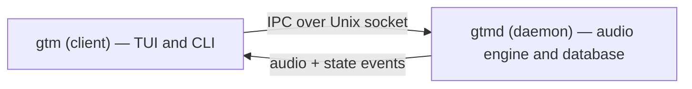

`gtm` is an attempt to reimagine what the terminal audio player is supposed to accomplish while giving a polished TUI experience. Designed from the ground up with integration with other terminal tools (via IPC), `gtm` is actually the client for `gtmd`, the daemon process responsible for playback.

```mermaid
graph LR
    Client["gtm (client) — TUI and CLI"]
    Daemon["gtmd (daemon) — audio engine and database"]
    Client -->|IPC over Unix socket| Daemon
    Daemon -->|audio + state events| Client
```

The daemon owns audio output, the library database, network providers, and
  the playback state machine. A client just sends requests; the daemon streams events back
  in real time. Multiple `gtm` processes (or any clients) can attach to the same daemon simultaneously.

Using this approach of having the client seperate from the daemon (which is like a server) we can have uninterrupted playback that is not attached to our terminal session.

The client is free to attach and detach as the user pleases, allowing the flexibility to jump in and out of playlists without having to leave the terminal.

I wrote all about the motivations behind this project [here](https://prjctimg.me/blg/feature-rich-terminal-audio-player) for a more technical deepdive. 

